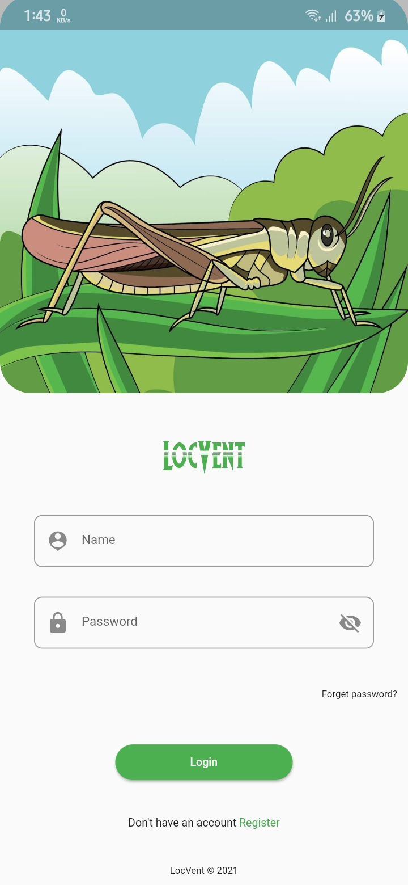
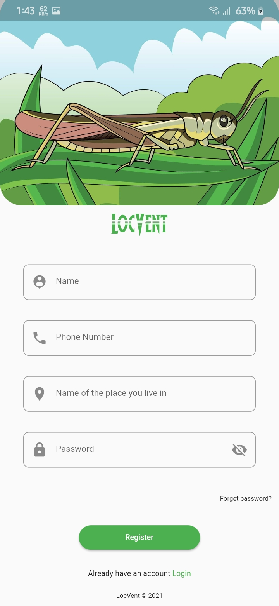
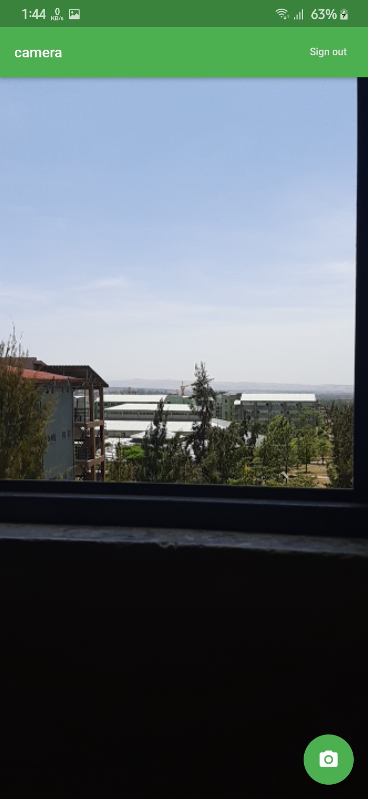
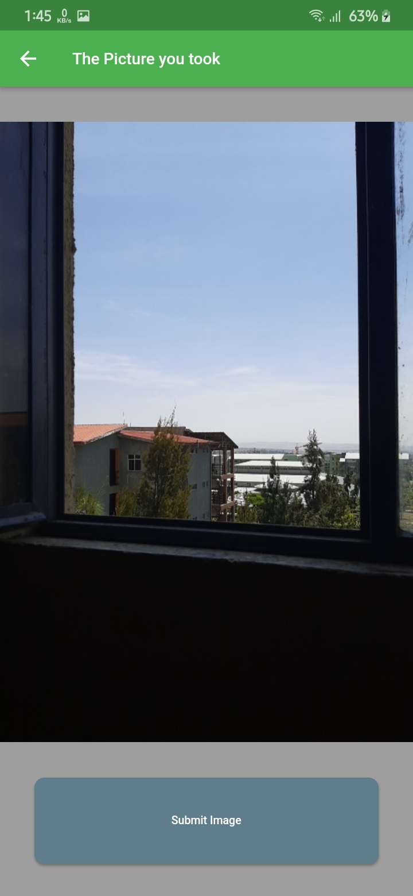
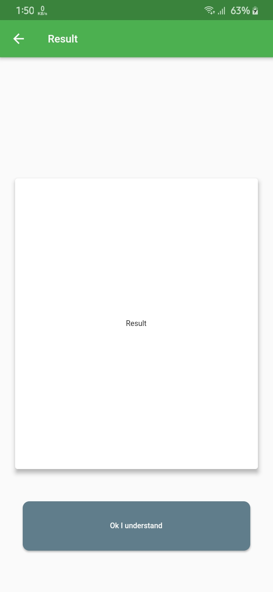

# LocVent
 

`Flutter application that helps in early detection of Locust outbreak.`

<table border="1">
<tr><td></td>
<td></td>
<td></td>
<td></td>
<td></td></tr>
<tr>
<td>
Login
</td>
<td>
sign up
</td>
<td>
Taking picture of the locust
</td>
<td>
Submiting the picture
</td>
<td>
Viewing Result
</td>
</tr>
</table>

## Features

* [X] AD-FREE
* [X] sign up
* [X] sign in
* [X] take a picture of Locust 
* [X] sending picture
* [X] Accepting feedback
* [ ] Forgot password

## Contribution
        
* Fork the repo
* Create a new branch `git checkout -b '$username_$feature'`
* Open a pull request 😁

